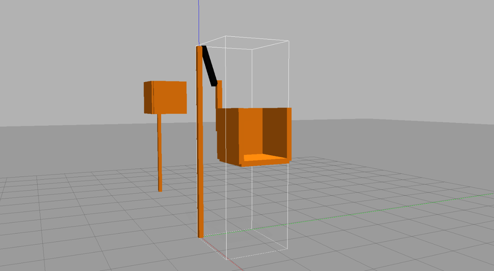
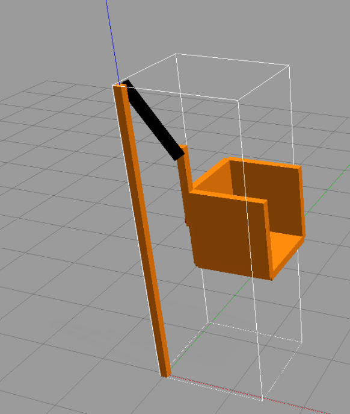
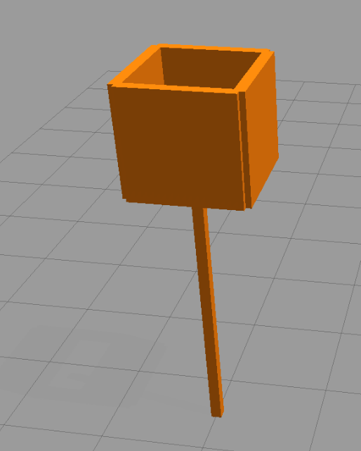

# Robo-Pitcher

By Frank Hu & Cole Peterson

### Introduction

- Objective:
  Our final project is to make a robotic arm in Simulation that can throw a ball into a hoop from a distance. 
- Challenges/Goals:
  - Simulation Modeling
  - Smooth Throwing Motion
  - Planned/Precise Throwing (Reach Goal)

### What was Created/Implemented:

### Simulation Model: 

#### Arm:

Our Simulation Model was modeled off [rrbot](https://github.com/ros-simulation/gazebo_ros_demos), a basic arm made from three rectangular poles which served as arm segments, and two joints connecting these segments.

- Catapult Model:
  		We then added an open box to the end of the final arm segment which was used to hold the ball while the arm was swinging. 

#### Basket Model:

- Objective:
  - To demonstrate that our throwing is controlled, we also designed a basketball-like net as a target hop

- Implementation:
  	We used rrbot's xacro file as a base, used similar method to adding the catapult, and built a basket hoop

### Control Algorithm:

#### 	Control Problem: 

​	The arm joints are revolute, effort, positional joints that have 1 degree of freedom and take in a float angle in radius as control input. When a joint receives an angle, the joint uses a PID controller to reach the received angle, which results in over-swing and redundant compensation. Such a condition is not ideal for throwing. Having an arm idling then suddenly accelerates to 50 rad per second is terrible for controlled throwing. Surely, it throws, but no-one knows where it would go.

#### 	Failed Solution:

 	Due to the lack of velocity control over the arm, we attempted to gather data on the robot’s current rotational speed, and use that to give new movement commands until the correct speed was obtained. However, the joint position controllers did not by default publish any information on current velocity.

#### 	Final Solution:

​	 Because of this, we changed the joint type to be Velocity controllers. This is to say that we changed the programming of our joint controller to take in a velocity command in radians per second, and use the pid algorithm to reach this speed regardless of angle. Then it was a simple task to publish a desired speed and track the current angle (which was being published by default). With this vital data and control over velocity we were ready to create an algorithm for throwing a ball to an accurate distance, as was our original plan.

### Math:

####   Objective: 

- Given a desired input distance, the algorithm figures out the velocity and throwing angle, then executes.

####   Initial Goal:

* Default throwing angle at 45 degrees, and base our velocity calculation off this assumption

#### Reason behind Initial goal:

* 45 degrees is a nice assumption as it protect the arm from over throwing. According to the calculations of physicists, the best angle to throw an object in order to maximize distance is 45 degrees (an explanation of why can be found [here](https://www.scientificamerican.com/article/football-projectile-motion/#:~:text=The%20sine%20function%20reaches%20its,an%20angle%20of%2045%20degrees)

#### Initial Implementation:

​	With this initial goal in mind, we searched online for the projectile motion equation which relates distance moved to angle and speed of the projectile. This is known as the Range Equation, and takes the following form:

$$
R = (v2 * sin(2θ))/g
$$
In this equation, In this equation, R is the range (or total distance) of the projectile, v is velocity, and g is gravity. Using this, we simply solved for v in order to determine what speed was necessary to reach the given R with a known gravity. With the assumption of 45 degree, sin(2θ)=sin(90) comes out to equal 1. 

​	However, simply calculating the velocity wasn’t the last step. This equation provided the linear velocity needed to meet our requirements, but the commands we gave our robot arm were angular. As such we had a final calculation to make, which was simply dividing the linear speed by the radius of the arm in order to determine the angular velocity it had to rotate in order to generate the correct velocity upon release at 45 degrees. At this point we had basically solved the problem, though a few trivial considerations had to be taken. The first was that our arm did not launch the ball directly at its origin. When the arm was at 45 degrees, where it stopped moving and released the ball, the end of the arm was actually about 1.2 meters behind the origin of the robo-pitching bot. As such, when calculating distance we added 1.2 to the user input to account for this constant offset.

​	With this information, we could publish commands to the robot joints to reach the appropriate launch velocity. It was then necessary to program it to stop immediately upon reaching 45 degrees so that the ball would continue uninhibited. Then, it was programmed to move back down until reaching what we referred to as a ‘loading’ position where a new ball could be placed, and new user input gathered. We chose approximately 160 degrees, since it was a convenient angle for placing the ball, and allowed enough time for the arm to reach velocity before getting to 45 degrees, however a large range of other options would be equally viable. 

